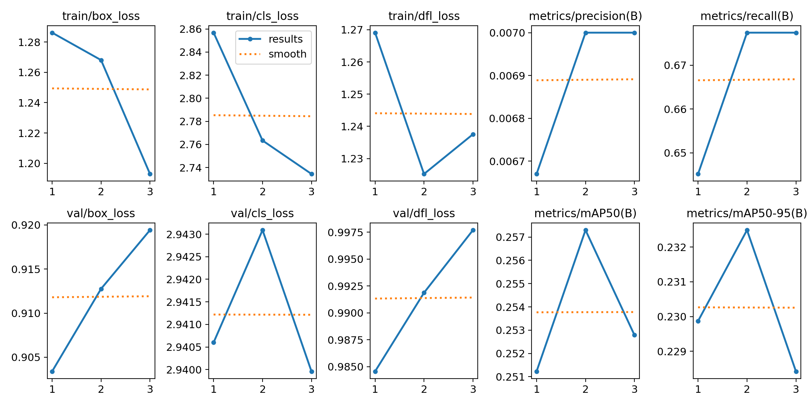

# Compte Rendu de Projet : Détection d'Objets & MLOps orchestré

## 1. Présentation du Projet
Ce projet implémente un pipeline complet de détection d'objets (YOLOv8) pour identifier des personnes dans un dataset filtré (**Tiny COCO**). L'objectif est de démontrer l'intégration d'outils MLOps modernes (**ZenML**, **MLflow**, **MinIO**, **Docker**) pour automatiser le cycle de vie du modèle, de l'entraînement au suivi des performances.

## 2. Architecture Technique
Le projet repose sur une infrastructure conteneurisée et une orchestration par étapes :

*   **Modèle** : YOLOv8 Nano (Ultralytics).
*   **Orchestration** : [ZenML](src/zenml_pipelines/yolo_pipeline.py) pour structurer le workflow en étapes reproductibles.
*   **Tracking** : [MLflow](http://localhost:5000) pour journaliser les hyperparamètres, les métriques et les poids du modèle.
*   **Artifact Store** : [MinIO](http://localhost:9000) (S3) pour le stockage centralisé des données et des modèles.
*   **Infrastructure** : Docker Compose pour la gestion des serveurs MLflow et MinIO.

## 3. CI/CD & Monitoring
Le projet inclut une automatisation pour garantir la qualité du code et du modèle :
*   **CI (GitHub Actions)** : Validation automatique à chaque commit (Linting via `flake8`, Smoke test d'entraînement).
*   **Monitoring** : Un script de surveillance ([src/monitor_runs.py](src/monitor_runs.py)) compare les performances du modèle actuel par rapport à une base historique et logue les alertes dans MLflow.
*   **Automation locale** : Utiliser [scripts/cicd_pipeline.ps1](scripts/cicd_pipeline.ps1) pour valider les changements localement avant de pusher.

## 4. Structure du Pipeline ZenML
Le pipeline `yolo_training_pipeline` est découpé en trois composants clés :
1.  **DataLoader** : Récupération du dataset Tiny Person.
2.  **Trainer** : Entraînement avec injection automatique des hyperparamètres dans MLflow.
3.  **Evaluator** : Calcul du mAP50 et validation finale avant stockage.

## 4. Analyse des Expériences (Hyperparameter Tuning)
Nous avons utilisé un script de **Grid Search** ([src/zenml_pipelines/run_yolo_pipeline_grid.py](src/zenml_pipelines/run_yolo_pipeline_grid.py)) pour comparer l'impact de la taille d'image (`imgsz`) et du taux d'apprentissage (`lr0`).

### Résultats mAP50 obtenus :
| Taille Image | LR = 0.005 | LR = 0.01 |
| :--- | :--- | :--- |
| **320px** | 0.152 | 0.152 |
| **416px** | **0.256 (Best)** | **0.256** |

**Conclusion** : L'augmentation de la résolution à 416px est le facteur le plus influent pour améliorer la détection des petites silhouettes.

## 5. Visualisation des Performances
Voici les graphiques générés durant l'entraînement du meilleur modèle (`imgsz=416`) :

### Courbes d'Entraînement (Loss & Metrics)


### Performance de Détection
| Courbe Précision-Rappel | Matrice de Confusion |
| :---: | :---: |
|  |  |

### Prédictions sur le jeu de Validation


## 6. Guide de Reproduction (Quickstart)

### Prérequis (Windows)
*   Docker Desktop installé et lancé.
*   Python 3.11 avec l'environnement virtuel activé.

### Installation et Lancement
1.  **Démarrer l'infrastructure** :
    ```powershell
    docker-compose up -d
    ```
2.  **Lancer le pipeline de test** :
    ```powershell
    $env:PYTHONUTF8=1
    python -m src.zenml_pipelines.run_yolo_pipeline_baseline
    ```
3.  **Visualiser les résultats** :
    *   **Dashboard ZenML** : `zenml login --local --blocking`
    *   **Dashboard MLflow** : [http://localhost:5000](http://localhost:5000)

## 6. Améliorations Futures
*   Augmenter le nombre d'époques (limité à 3 pour les tests rapides).
*   Ajouter une étape de déploiement automatique vers un serveur d'inférence (MLServer).
*   Intégrer DVC pour le versionnement des versions brutes du dataset Tiny COCO.

---
**Auteur :** Nadhir  
**Date :** 17 Janvier 2026  
**Modèle utilisé :** Gemini 3 Flash (Preview) via GitHub Copilot


